# update-service

The Update Service re-configures vehicle ECU's with new secure images, to fix bugs and/or add new functionality. The Service also maintains the vehicle ECU state, via a manifest detailing the version information, of the released images, executing on the truck. Over the Air (OTA) packages are downloaded from Nikola Fleet Command to the vehicle and forwarded to the Update Service for processing.
The Update Service manages disemination of the images to the appropriate recipient:

1. VHU update is managed by the update service
1. VHU Peripherals are managed by the service that manages that device
  <br>a. CCU Device - CCU Service
  <br>b. RTM Device - Radio Service
  <br>c. Nordic Device - BLE Service
1. ECU Updates - CGW2 Service

Below Find the High Level Design (HLD) of the Update service, depicting the interactions of the various services.

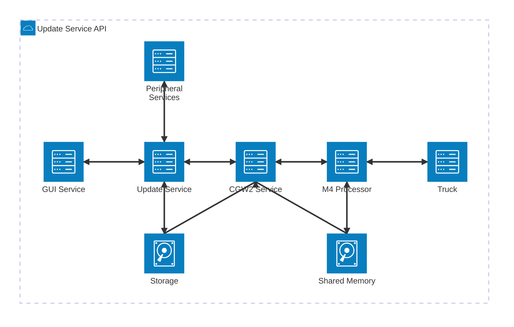

## Table of Contents
- [update-service](#update-service)
  * [Table of Contents](#table-of-contents)
  * [Development](#development)
    + [Building update Service](#building-update-service)
    + [Testing](#testing-update-service)
  * [Transport API](#api)
    + [Received Messages](#messages)
      + [update_available and restage_update](#update_available-&-restage_update)
      + [Update Vehicle](#update)
      + [Update CGW State](#cgw_state)
      + [Is OTA Allowed](#is_ota_allowed)
      + [Stop OTA Per-Checks](#stop_ota_pre_check)
      + [Stortp OTA Per-Checks](#start_ota_pre_check)
      + [OTA Per-Check Status](#ota_pre_check_status)
      + [Vehicle Manifest Generated](#manifest_generated)
      + [Toggle OTA Pre Checks](#toggle_ota_precheck)
      + [Toggle ECU Diagnostic Request](#toggle_ecu_diag_precheck)
    + [Transmitted Messages](#commands)
      + [BLE Service](#ble-service)
      + [CCU Service](#ccu-service)
      + [Radio Service](#radio-service)
      + [Amber Service](#amper-service)
      + [System Service](#system-service)
      + [Vehicle State Service](#vehicle-state-service)
      + [CGW2 Service](#CGW2-service)
    + [Configuration File](#update-service-configuration-file)
  * [Interactions](#interactions)
  * [Documentation](#documentation)
    + [Open Source References](#open-source-references)
    + [Architecture](#architecture)
  * [Contributing](#contributing)
  * [Contributors](#conributors)

## Development

The Update Service was developed in a Linux environment using the Crystal Language. Crystal was choosen since it compiles to native ARM code and provides seemless "C" language bindings.
The build environment is described in the [README.BUILD.md](https://git.nikolamotor.com/core/vhu/vhu/-/blob/main/microservices/update_service/README.BUILD.md?ref_type=heads)

### Building Update Service

#### To build and upload to your connected bench, (in docker, in service directory)

make arm && make arm install && bench sync

#### To watch the logs generated by the service (on VHU)

journalctl -uf update-service

#### To start or stop the service (on VHU)

systemctl stop update-service
systemctl start update-service
systemctl restart update-service

### Testing Update Service

Update Service is tested in a Docker container  environment, with VHU Services running, and is supported by the CGW Simulator. How to configure your docker container can be found here: [Update Service Docker Setup](https://nikolamotor.atlassian.net/wiki/spaces/STS/pages/3972136963/Update+Service+Docker+Setup).<br>
Running an OTA is explained here: [OTA Simulator Testing](https://nikolamotor.atlassian.net/wiki/spaces/STS/pages/3972071434/OTA+Simulator+Testing)

## Transport API

This section describes the messages transmitted and recieved and the operations set in motion by those messages. The service primarily recieves requests from the GUI Service and Nikola Fleet Command, in the AWS Cloud. Secondarily the service may, under service circumstances recieve requests, to assist a technician to complete an OTA when conditions are not ideal.

### Received Messages

This section describes the messages recieved by the service and the operations performed upon reciept of said message.  Below is a detailed description of the operation requested.

#### update_available-&-restage_update

Recipt of the update_available request, informs the service that an OTA package has been downloaded from Nikola Fleet Command.

##### Input

  String: path to OTA Package

##### Method Invoked

  def `stage_update`(pkg_path : String?, restage : Bool = false)<br>
  Return : `nil`
  
  or

  def `restage_update`(pkg_path : String?, restage : Bool = false)<br>
  Return : `nil`

The service processes the request by staging the OTA package recieved from Fleet Command. The package is unpacked and verified. The ECU images are sent to the CGW2 Service to securly move the images from the VHU to the Nikola CGW device. This is dome by putting the image data in shared memory and asking the requests the ADAS M4 processor to move the data from shared memory to the Nikola CGW device.<br>Below find the sequence diagram describing the ota staging process.

###### <p style="text-align:center;">VHU Staging Process</p>

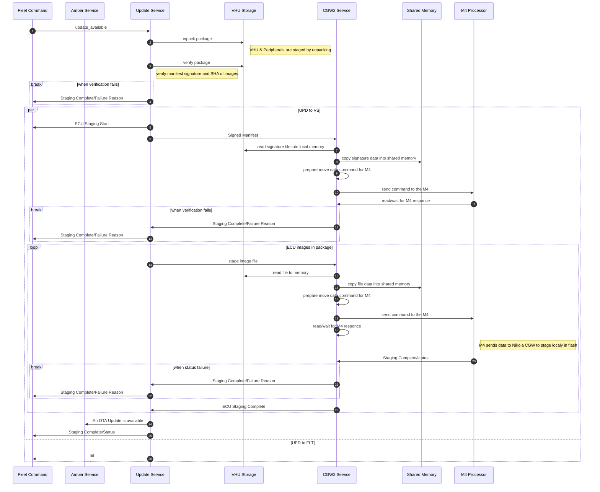

#### <p style="text-align:center;">VHU Staging Process Steps</p>

Further detail concerning the steps in the sequence diagram above.

- Fleet informs the Update Service that an update is available.
- Update Service unpacks the package to VHU persistant storage (SSD).
- Update Service verifies the manifest signature, and the SHA of each image in the package.
- If the verification fails?
  - send staging complete event with the failure reason and exit.

- Spawn a process to manage the staging, send the staging start event. The request instance returns/exits.
  - Send the Signed Manifest request to the CGW2 Service.
  - CGW2 Service reads the CGW packed manifest file into memory.
  - CGW2 Service copies the CGW packed manifest data into shared memory.
  - CGW2 Service prepares the move data, from shared memory to the Nikola CGW ECU, M4 command.
  - CGW2 Service sends the command to the M4.
  - CGW2 Service blocks on a read to the M4 to return the status of the operation.
  - M4 sends the status of the request
  - If the operation failed?
    - CGW2 Service Informs Update service of the failure.
    - Update Service Informs Fleet of the failure and exits.
  - Loop over images in package
    - Update Service requests CGW2 Service to stage an ECU image,
      - Sending the path of the image in VHU Storage.
    - CGW2 Service reads the image data from VHU Storage.
    - CHW2 Service copies the image data to shared memory accessable by the M4.
    - CGW2 Service prepares a packed command requesting the M4 to move the image data from shared memory to the CGW device via the UDS protocol.
    - CGW2 Service sends the command to the M4.
    - CGW2 Service waits on a read to the M4.
    - M4 responds with staging complete and a status.
    - If staging failed?
      - CGW2 Service Informs Update service of the failure.
      - Update Service Informs Fleet of the failure and exits.
    - CGW2 Service sends staging complete for this ECU success.
  - Update Service sends an OTA Update is available to GUI Service.
  - Update Service sends staging complete success to Fleet.
  - and main request instance
    - Update Service returns/exit.

#### update

The request to install a staged ota package.
Recipt of the update request, informs the service to install the previously staged OTA package.  This request comes from the driver via the GUI service when the driver presses the Update Button on the infotainment display.

##### Input

  package_path          : String  - path to OTA Package<br>
  origin                : String  - service name requesting the update<br>
  multi_ota_in_progress : Boolean - is this a multi package OTA or a normal single package OTA?

##### Method Invoked

The request to install a previously staged OTA Package.

Method invoked
def `run_update_with_inhibit`(package_path : String?, origin : String, multi_ota_in_progress : Bool = false)<br>
return  : Hash(String, String)?

The service then processes the request from GUI Service, by installing the staged OTA package. The service unpacks and verifies the package.  Performs checks and requests diagnostic mode<br>`Note: this request to the CGW device begins the ECU install process.`<br>The VHU is installed then the VHU Peripherals in parallel to the ECUs.  Then the service waits for the CGW2 Service to respond the completion status.<br>Below find the sequence diagram describing the ota update process.

#### <p style="text-align:center;">**VHU Install Process**</p>

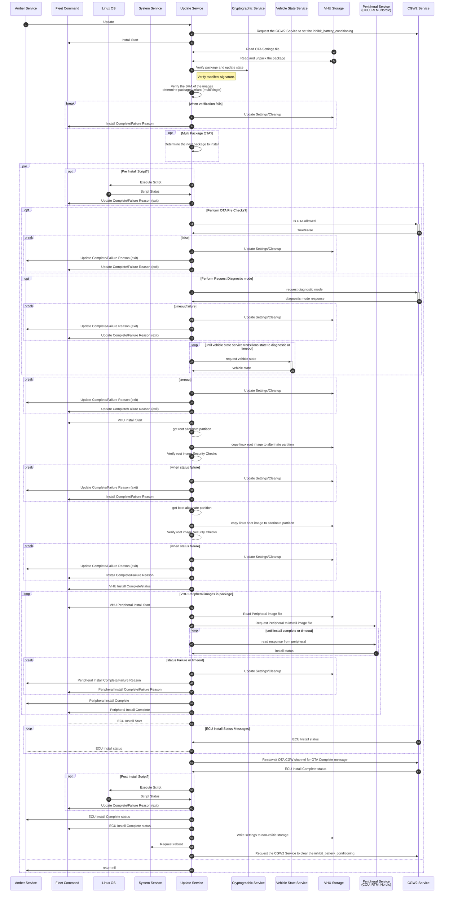

#### <p style="text-align:center;">VHU Install Process Steps</p>

Further detail concerning the steps in the sequence diagram above.

- The driver begins the Update by depressing the Update button on the service screen.  <br>This invokes the run_update method, beginning the update process.
- Update Service requests CGW2 Service to set the bit in shared memory, informing the vehicle to not attempt to condition a battery.
- Update Service informs Fleet, by sending an OTA Event, that an update has begun.
- The service reads the settings file from storage.
- Update Service unpacks the package to VHU temporary storage (SSD).
- Update Service requests Cryptographic Service to verify the manifest signature, and Update Service verifies the SHA of each image in the package.
- If the verification fails?
  - Update settings to reflect failure and remove and free any temporary data storage..
  - Send the update complete event with the failure reason to GUI Service and exit.
  - Send the update complete event with the failure reason Fleet and exit.

- If this is a multi package OTA?
  - Determine the next package and setup the system to install the next single OTA package.

- Spawn a process to manage the installation, send the staging start event. The request instance returns/exits.
  - If a pre install script is in the package?
    - Request the Linux OS to execute the script, which may clear faults, do som cleanup etc.
    - Recieve the status of the script execution from Linux.
    - Report the status of the script to Fleet<br>`Note: Script failure does not stop the install process.`
  - If verify the precheck state?
    - Request the pre check status from the CGW2 Service.
    - Read/wait for response from the CGW2 Service.
    - If OTA is not allowed(false)?
      - Update settings to reflect failure and remove and free any temporary data storage..
      - Send the update complete event with the failure reason to GUI Service and exit.
      - Send the update complete event with the failure reason Fleet and exit.

  - If request diagnostic mode?
    - Request the CGW2 Service to put the vehicle in diagnostic mode.
    - Read/wait for the CGW2 Service to acknowledge the request.
    - If the read timesout or CGW2 returns failure?
      - Update settings to reflect failure and remove and free any temporary data storage..
      - Send the update complete event with the failure reason to GUI Service and exit.
      - Send the update complete event with the failure reason Fleet and exit.

    - Loop waiting for the vehicle to transition to diagnostic mode.<br>`Note: Vehicle state service is informed that the vehicle has entered diagnostic mode, via signals mapped from shared memory.`
      - request vehicle state from Vehicle State Service.
      - break out of loop if the state is diagnostic

  - If the wait for transition to diagnostic mode timed out?
    - Update settings to reflect failure and remove and free any temporary data storage..
    - Send the update complete event with the failure reason to GUI Service and exit.
    - Send the update complete event with the failure reason Fleet and exit.

  - Inform Fleet that a VHU update has begun.
  - Inform GUI Service that a VHU update has begun.
  - Get the alternate root partition.  (This is where the new image will be copied)<br>`Note: The system maintains two partitions for update purposes`<br>The system executes from the root partition, leaving an alternate for updates.
  - Copy the new VHU image to the alternate partition.
  - Perform the security checks on the new root image.
  - If the security checks fail?
    - Update settings to reflect failure and remove and free any temporary data storage.
    - Send the update complete event with the failure reason to GUI Service and exit.
    - Send the update complete event with the failure reason Fleet and exit.
  - Inform Fleet that a VHU update has begun.
  - Get the alternate boot partition.  (This is where the new boot loader will be copied)
  - Copy the new boot image to the alternate partition.
  - Perform the security checks on the new boot image.
  - If the security checks fail?
    - Update settings to reflect failure and remove and free any temporary data storage.
    - Send the update complete event with the failure reason to GUI Service and exit.
    - Send the update complete event with the failure reason Fleet and exit.
  - Inform Fleet that a VHU update has completed.
  - Inform GUI Service that a VHU update has completed.
  - Loop over the VHU Pererial images contained within the package.
    - Inform Fleet that a VHU Peripheral update has begun.
    - Inform GUI Service that a VHU Peripheral update has begun.
    - Read the image file from VHU Storage
    - Send the image to the appropriate VHU Peripheral Service<br>    `CCU Device - CCU Service`<br>    `RTM Device -  Radio Service`<br>   `Nordic Device - BLE Service`
    - Request the Peripheral Service to install the new Image.
    - Wait on a channel, for the response, to be delivered from the from the peripheral service.
    - If the service returns failure or a wait timeout?
      - Update settings to reflect failure and remove and free any temporary data storage.
      - Send the update complete event with the failure reason to GUI Service and exit.
      - Send the update complete event with the failure reason Fleet and exit.
    - Inform Fleet that a VHU peripheral update has completed.
    - Inform GUI Service that a VHU peripheral update has completed.
  - Inform Fleet that the ECU install has begun.
  - Loop over reads from the CGW2 Service, waiting for the install complete message.<br>The loop runs until recipt of an install complete message or times out waiting for completion.
    - Receive install status from the CGW2 Service.
    - Inform the GUI Service of the new instalation status (Update Display)
  - If the ECU install failed or timed out?
    - Update settings to reflect failure and remove and free any temporary data storage.
    - Send the update complete event with the failure reason to GUI Service and exit.
    - Send the update complete event with the failure reason Fleet and exit.
  - Recieved Install Complete with Success inform GUI Service update was successful.
  - If a post install script is in the package?
    - Request the Linux OS to execute the script, which may clear faults, do som cleanup etc.
    - Recieve the status of the script execution from Linux.
    - Report the status of the script to Fleet<br>`Note: Script failure does not stop the install process.`
  - Inform Fleet that the update was successful.
  - Write updated settings reflecting a successful update and Multi Package state(if applicable).
  - Request the System Service to reboot the VHU.
  - Update Service requests CGW2 Service to clear the bit in shared memory.
- and main request instance
  - Update Service returns/exit.

The final step of the install happens when the service restarts and reads the settings and is informed to complete the installation.  While the VHU has reset the ECUs are still in diagnostic mode and some have not switched banks to the new versions.<br>`Note: Some Non-Nikola ECUs do not support multiple versions are are already updated.`

#### <p style="text-align:center;">VHU Reboot Post Install</p>

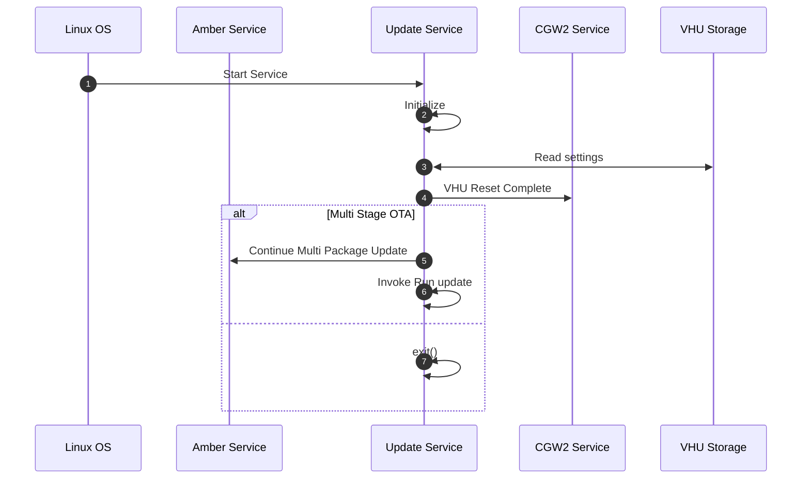

#### <p style="text-align:center;">VHU Reboot Post Install Steps</p>

Further detail concerning the steps in the sequence diagram above.

- Update Service starts and initializes.
- The service reads the settings file from storage.
- Update Service sends the `ota_reset_complete` command to CGW2 Service.
- If this is a multi-stage OTA?
  - Update Amber Service sending the step in the multi package update
  - Start the next install step in the package
. else single package
  - exit() and wait for something to do.

#### cgw_state

This Update informs the Update Service of the state of the CGW to allow the service to make decisions on weather to update or not.

##### Input

  state : String - enum name for the current CGW state.

##### Method Invoked

  def `set_cgw_state`(state : String)<br>
  Return : `nil`

The Update Service receives the state of the CGW and stores it, to allow the service to make later decisions.  Below find the sequence diagram describing this process.

#### <p style="text-align:center;">Set the CGW State</p>

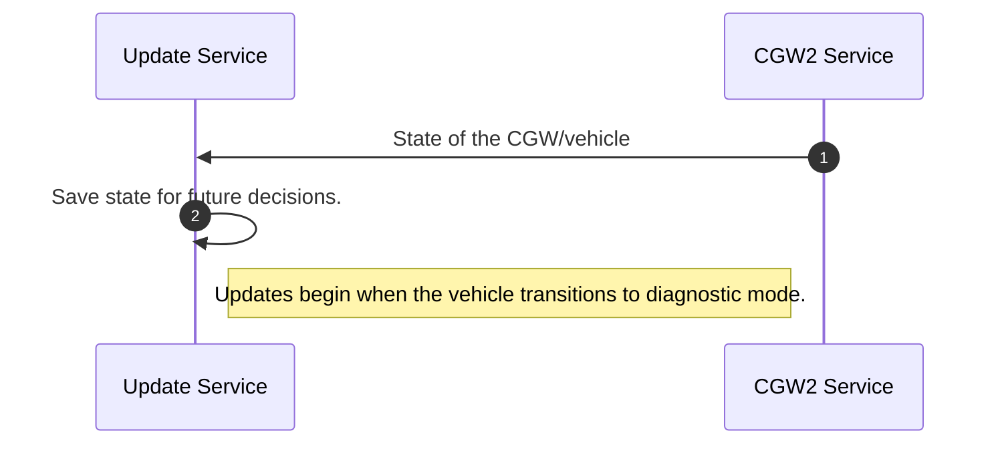

#### is_ota_allowed

The service is asked if an OTA may proceed or must wait.

##### Input

  nil
##### Method Invoked

  def `is_ota_allowed`()<br>
  Return : `Bool`

The Update Service forwards the request to the CGW2 Service, which returns the current status.  The status is evaluated to determine  GO/NOGO response.

#### <p style="text-align:center;">Is OTA Allowed</p>

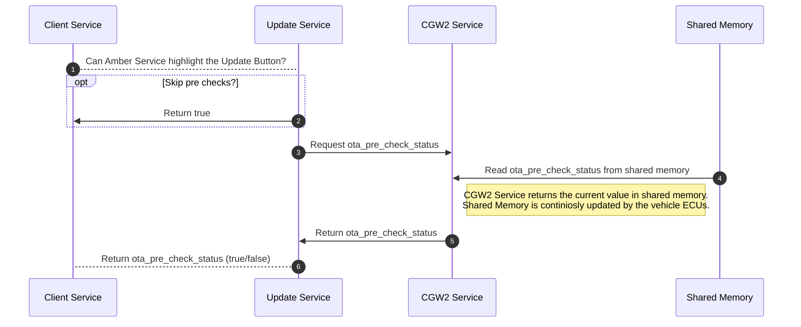

#### <p style="text-align:center;">Is OTA Allowed Steps</p>

Further detail concerning the steps in the sequence diagram above.

- The request if an OTA may proceed?
- If the pre checks have been toggled off?
  - Return true.
- Request the status from CGW2 Service.
- CGW2 Service reads the Pre Ckeck Status from Shared Memory.
- CGW2 Service returns the Pre Ckeck Status to Update Service.
- Update Service evaluates the status and returns (true/false) to the client, based upon the condition of the status data.


#### stop_ota_pre_check

The service is requested to stop the OTA pre check process.

##### Input

  nil
##### Method Invoked

  def `stop_ota_pre_check`()<br>
  Return : `nil`

The Update Service forwards the request to the CGW2 Service, which in turn tells the VCM to stop the pre checks.


#### <p style="text-align:center;">Stop the VCM OTA Pre Checks</p>

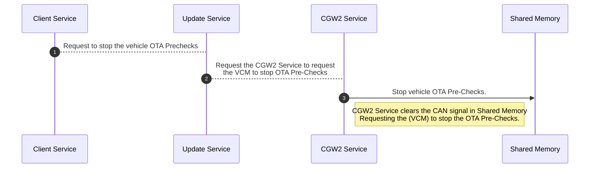

#### start_ota_pre_check

The service is requested to start the OTA pre check process.

##### Input

  nil
##### Method Invoked

  def `start_ota_pre_check`()<br>
  Return : `nil`

The Update Service forwards the request to the CGW2 Service, which in turn tells the VCM to start the pre checks.

#### <p style="text-align:center;">Start VCM OTA Pre Checks</p>

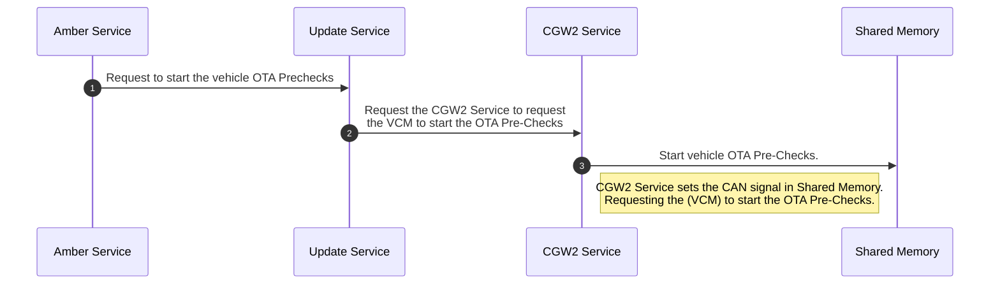

#### ota_pre_check_status

The pre check status is periodically sent to the update service, in a Hash(String, String).

##### Input

  status : Hash(String, String) - A hash containing the pre check status UInt32 in the key 'status_word'.

##### Method Invoked

  def `ota_pre_check_status`(response : Hash(String, String))<br>
  Return : `nil`

The service receives pre check status, when it changes, from the CGW2 Service, and saves the status off. Update Service then informs Amber Service of the status changes, while the pre checks are on.<br>`Note: Amber service manages the control of the prechecks on/off state.`

#### <p style="text-align:center;">VCM OTA Pre Check Status</p>

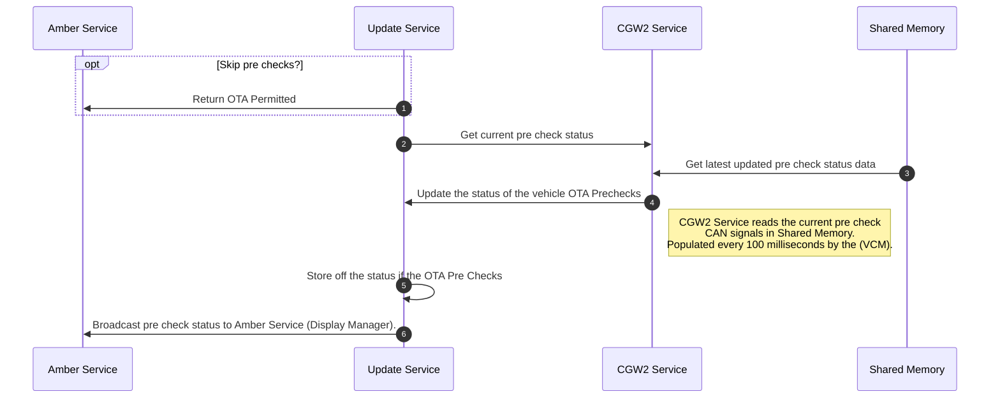

#### <p style="text-align:center;">VCM OTA Pre Check Status Steps</p>

Further detail concerning the steps in the sequence diagram above.

- If the pre checks have been toggled off?
  - Return true.
- Request the status from CGW2 Service.
- CGW2 Service reads the Pre Ckeck Status from Shared Memory.
- CGW2 Service returns the Pre Ckeck Status to Update Service.
- Update Service evaluates the status and formats a display appropriate list of pre check failures, if any, the go/nogo status and forwards said data to to Amber Service.


#### manifest_generated

This Update informs the Update Service of the state of the CGW to allow the service to make decisions on weather to update or not.

##### Input

  nil

##### Method Invoked

  def `manifest_check`()<br>  Return `nil`

The Update Service receives theHash(String, UInt32 | String | Nil) state of the CGW and stores it,Hash(String, UInt32 | String | Nil) to allow the service to make later decisions.  Below find the sequence diagram describing this process.

#### <p style="text-align:center;">Manifest Generation Process</p>

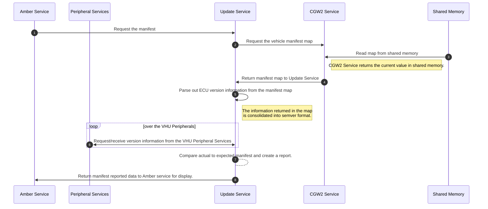

#### <p style="text-align:center;">Manifest Generation Process Steps</p>

Further detail concerning the steps in the sequence diagram above.

- The driver begins the Manifest Generation Process by depressing the Manifest button on the service screen.
- Update Service requests the manifest map from GW2 Service.
- CGW2 Service reads the Manifest Map from Shared Memory.<br>`Note: manifest data only changes on update, so it is mainly static.`
- CGW2 Service returns the Manifest Map to Update Service.
- Update Service parses the manifest map extracting the versions of:
  - Hardware
  - Application
  - Boot Loader
  - Calibration
<br>  and formatting each into semver format, for each ECU on the vehicle
- Loop over the VHU Peripherals
  - Request/Receive version information from each VHU Peripheral.
- Update service compares actual/reported versions with the expected versions.  The service then generates a report to forward to Amber Service.
- The Manifest Report is sent to Amber Service.

#### toggle_ota_precheck

Flip the value from it's current state to the other state.  The boolean is flipped from true to false or vica-versa.<br>`Note: This command is only available to a service technician with the proper login credentials.`

##### Input

  nil

##### Method Invoked

  def `handle_ota_precheck_toggle`()<br>
  Return : `nil`

The service receives a request to flip the state of the boolean controlling if the pre checks are started.

#### <p style="text-align:center;">Toggle OTA Pre Checks (On/Off)</p>

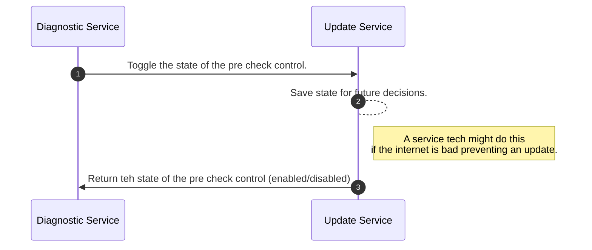

#### toggle_ecu_diag_precheck

Flip the value from it's current state to the other state.  The boolean is flipped from true to false or vica-versa.<br>`Note: This command is only available to a service technician with the proper login credentials.`


##### Input

  nil

##### Method Invoked

  def `handle_ecu_diag_precheck_toggle`()<br>
  Return : `nil`

The service receives a request to flip the state of the boolean controlling if diagnostic mode is requested.

#### <p style="text-align:center;">Toggle Diagnostic mode transition (On/Off)</p>

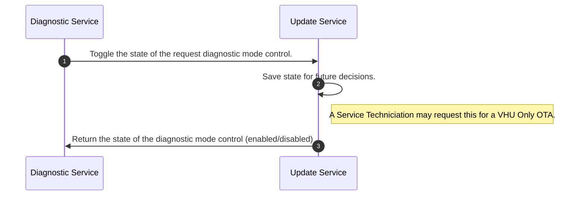

### Transmitted Messages

The Update service transmits multiple messages during staging and update. Update Service requests the VHU Peripheral services to:

- report firmware versions
- Install a new image

The service also notifies Fleet and Amber Service of staging/install progress.  Update Service makes requests to the CGW and Vehicle State Services to support the staging or install process. The System Service is requested to save logs from events and restart the VHU to complete an update.

#### radio-service

Radio Service manages the Radio Tuning Module (RTM) device to assist OTA and radio function.

- "get_fw_version"
- "rtm_fw_update"

#### ccu-service

CCU Service manages the CCU device to assist OTA and LTE and GPS functionality.

- "get_ccu_fw_version"
- "firmware_update"

#### ble-service

Radio Service manages the Nordic Bluetooth Low Energy (BLE) device to assist OTA and BLE for phone app access and BLE device reporting.

- "get_firmware_version"
- "update_dfu"

#### system-service

Update Service requests System Service to perform two functions:

1. Save off journal log files after an update or staging.
1. Reboot the VHU to switch to a new updated version of the image.

- "dump_log"
- "reboot_request"

#### amber-service

Amber service recieves unsolicited updates from update service. Update Service informs Amber Service that a new OTA package has arrived and it's staging status.   Amber Service is updated with OTA per check status, when the Infotainment Display is on the Service window.  Amber Service is also informed of the progress of any active update initiated by the driver via Amber.

- Staging
  - "update_available"
  - "staging_failure_service_center_needed"
  - "staging_failure"

- Pre Check Gate
  - "ota_pre_check_status"

- Updating/Install
  - "applying_update"
  - "multi_package_updating"
  - "update_progress"
  - "multi_package_status"
  - "ota_updated"
  - "update_not_applied"
  - "finalizing_update"
  - "update_complete"

#### vehicle-state-service

Update Service requests the vehicle state and communications status(depreciated) from Vehicle State Service.  The service also updates vehicle state service when an update is in progress.

- "get_veh_state"
- "loss_of_comms_status" - depreciated
- "ota_started"

#### CGW2-service

Update Service makes many requests and updates to the CGW2 Service.  They fall in three main catagories:

1. Manifest operations
1. Staging new OTA Packages
1. Installing Staged Packages

Many of the request commands below may be issued once or many times.  Generally the commands set a process in motion that can return a single status or numerous progress messages from the CGW2 Service.<br>`Note: Requests to the CGW2 Service may begin some time consuming operations and numerous status updates.`<br>`Note: CGW2 Service requests the CGW device to move data(staging) or install data to any of some 20+ ECUs.`

- Manifest Updates
  - "manifest_tx"
  - "manifest_map"

- Staging Requests
  - "stage_manifest"
  - "stage_ecus"

- Pre Check Gate
  - "ota_pre_check_stop"
  - "ota_pre_check_start"
  - "get_pre_check_status"

- Install Updates/Requests
  - "inhibit_battery_conditioning"
  - "diag_mode_start"
  - "cgw_abort_ota"
  - "update_start" - depreciated
  - "vhu_reset_complete"

### Unsolicited Events

All Over the Air operations transmit initiation and status the Fleet Command.  This is done by writting event data to storage.  This storage is monitored by the Cloud Service and collected and forwarded to Fleet.<br>Below find the events forwarded to Fleet by operation.

#### -------- Staging ------------

{ "stage_ota_on_hold_update_already_in_progress", "ota_stage_start", "ota_stage_ecu_start", "ota_stage_ecu_complete", "run_update_no_action", "ota_stage_success", "ota_update_start", "manifest_sig_prod_verify_pass", "manifest_sig_dev_verify_pass", "ota_pkg_staging_start_res", "ota_pkg_staging_status", "ota_ecu_download_status", "ota_signed_manifest_start_res", "ota_signed_manifest_complete", "ota_ecu_staging_start_res", "ota_ecu_staging_complete", "ota_install_ready" }

#### -------- Update ------------

{ "settings_migration_start", "settings_migration_success", "multi_package_ota_continue", "multi_ota_no_bin_file_#{pkg["file"]}", "multi_package_ota_start", "ota_preinstall_hook_start", "ota_preinstall_hook_success", "ota_diag_mode_start_request_start", "ota_diag_mode_start_request_success", "ota_vehicle_state_diag_start", "ota_vhu_update_start", "ota_vhu_update_success", "ota_vhu_update_not_needed", "ota_rtm_update_start", "ota_broadcomsw_update_start", "ota_nordic_update_start", "ota_ccu_update_start", "ota_ecu_update_start", "ota_ecu_update_success", "ota_set_next_boot_alt_start", "ota_set_next_boot_alt_success", "ota_postinstall_hook_start", "ota_postinstall_hook_success", "tar_file_ota_no_supported", "imx-boot_auth_pass", "kernel_auth_pass", "rootfs_auth_pass", "ota_success_event", "ota_not_needed_event", "multi_package_done_success" }

#### -------- Manifest ------------

{ "manifest_ecus_fault", "manifest_peripherals_fault", "OTA_MISMATCH" }

### Configuration File(s)

The Update Service uses two configuration files.  The update-service.yml to configure the service at initialization and the ota.yml settings file to track the service state.

#### update-service.yml

This file is read at startup of the service and used to initialize control variables.

UPDATE_ENV: development<br>
<br>
production:<br>
  UPDATE_DIR: /userdata/ota/tmp<br>
  MANIFEST_PATH: /userdata/ota/manifest.current<br>
  MANIFEST_PATH_REPORTED: /userdata/ota/manifest.reported<br>
  MANIFEST_REPORT_CAL_VER: 0<br>
  VHU_VERSION_PATH: /etc/vhu-release<br>
  MAPS_DIR: /userdata/maps<br>
  MAPS_VERSION_PATH: /userdata/maps/version<br>
  BOOTLOADER: u-boot<br>
  SKIP_OTA_PRECHECKS: 0<br>
  SKIP_ECU_DIAG: 0<br>
  SKIP_ENFORCE_OTA_TIMEOUT: 0<br>
  UPDATE_STATUS_THRESHOLD: 30<br>
<br>
development:<br>
  UPDATE_DIR: ./update<br>
  MANIFEST_PATH: ../../tmp/manifest.current<br>
  MANIFEST_PATH_REPORTED: ../../tmp/manifest.reported<br>
  MANIFEST_REPORT_CAL_VER: 0<br>
  VHU_VERSION_PATH: ./update/vhu-release<br>
  MAPS_DIR: ./update/maps<br>
  MAPS_VERSION_PATH: ./update/maps/version<br>
  BOOTLOADER: none<br>
  SKIP_OTA_PRECHECKS: 0<br>
  SKIP_ECU_DIAG: 0<br>
  SKIP_ENFORCE_OTA_TIMEOUT: 0<br>
  UPDATE_STATUS_THRESHOLD: 30<br>

#### ota.yml

This file is read/written to maintain the current OTA and VHU state of the vehicle.

---<br>
updated_at: 2025-02-19 19:24:00.098898137<br>
software_update_status: post_success<br>
release_id: "1569"<br>
update_path: ""<br>
software_version: 4.32.1-1<br>
multi_pkg_release_id: ""<br>
multi_pkg_status: ""<br>
multi_pkg_path: ""<br>

## Interactions

- [socket-server](https://git.nikolamotor.com/core/vhu/socket_server)
- [microservice-helpers](https://git.nikolamotor.com/core/vhu/microservice_helpers)
- [crypto-service](https://git.nikolamotor.com/core/vhu/crypto_service)
- [amber-service](https://git.nikolamotor.com/core/vhu)
  - [API](#api) B
- [ccu-service](https://git.nikolamotor.com/core/vhu/ccu_service)
- [ble-service](https://git.nikolamotor.com/core/vhu/ble_service)
- [radio-service](https://git.nikolamotor.com/core/vhu/radio_service)
- [cgw2-service](https://git.nikolamotor.com/core/vhu/cgw_service)
- [vehicle-state-service](https://git.nikolamotor.com/core/vhu/vehicle_state_service)
- [system-service](https://git.nikolamotor.com/core/vhu/system_service)
- [cloud-service](https://git.nikolamotor.com/core/vhu/cloud_service)

The contents of an OTA Package are detailed in conflunce [Anatamy of an OTA Package](https://nikolamotor.atlassian.net/wiki/spaces/STS/pages/3972464646/Anatomy+of+an+OTA+Package)

### A. `amber-service` --> `update-service`
Command to start the update.

```json
{
    "command": "update",
    "path": <String>
}
```

### B. `update-service` --> `amber-service`

```json
{
  "command" => "update_progress",
  "body" => {
    "percent_completed" => 25 (or any other integer)
  }
}

//

{
  "command" => "update_complete",
  "body" => {
    "status" => #{"success" || "failure"}
    "message" => #{Generic success message or error message on failure},
    "release_id" => #{Integer corresponding to release ID on flux server},
    "vhu_version" => "3.2.4-1"
  }
}

//

{
  "command" => "ota_updated",
  "body" => {
    "status"  => #{"success" || "failure"},
    "version" => #{Version string / this key might not exist if we somehow get to the point of rebooting and the image is messed up}
  }
}
```

## Documentation

Update Service documentation is maintained in the Agile Stories for the Update Service in the Jira change management system. Many explanitory and debugging documents exist in Atlassian Confluence.

### Open Source References
[//]: # ([Optional] Add any used open source projects, software or repositories here)

OPTIONAL: Add any used open source projects, software or repositories here

### Architecture
[//]: # (Link to Microservices Lucidchart Here)

[NikolaOS Microservice Architecture](https://app.lucidchart.com/documents/edit/2f86423a-0ffc-452a-a8ab-6c52e44dd72d/0_0)

## Contributing

1. `Clone` repository to your machine
1. Create your feature branch (`git checkout -b my-new-feature`)
1. Commit your changes (`git commit -am 'Add some feature'`)
1. Push to the branch (`git push origin my-new-feature`)
1. Create a new Merge Request

## Contributors[Andrew Knoblach]: - Developer, Maintainer

- [Derek Wallace]:            - Creator & Maintainer
- [Aaron Brice]:              - Contributor & Maintainer
- [Derek Martin]:             - Contributor & Maintainer
- [Frank Burns]:              - Contributor & Maintainer
- [Jorge Robles-Valenzuela]:  - Contributor & Maintainer
- [Carlos Llanes]:            - Contributor & Maintainer
- [Chris Sawyer]:             - Contributor & Maintainer
- [Christopher Chitla]:       - Contributor & Maintainer
- [Justin Randall]:           - Contributor & Maintainer
- [Rohit Koppana]:            - Contributor & Maintainer
<br><br>
- [Jake Duchesne]:            - README Framework
- [Frank Burns]:              - README Content

Copyright © 2020 Nikola Corporation - All rights reserved
Confidential / Proprietary

 <a href="#top">Back to Top</a>